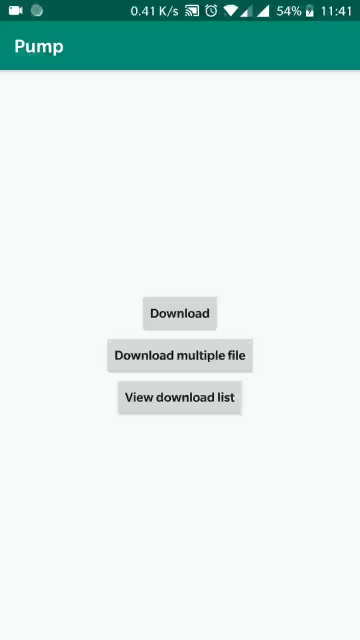

# Pump
[]( https://android-arsenal.com/details/1/7293 )

See the [English Doc](https://github.com/huxq17/Pump/blob/master/README.md) for English readme.

Pump是一个快速，易用的android下载库，支持多任务，多线程和断点下载，同时使用了Http缓存机制来避免不必要的下载，让下载更加智能。 [点击查看更多信息。](https://github.com/huxq17/Pump/wiki/%E4%BD%BF%E7%94%A8%E8%AF%B4%E6%98%8E)

### 配置 build.gradle：
App模块的build.gradle：

```
dependencies {
   implementation'com.huxq17.pump:download:1.3.10'
   implementation 'com.squareup.okhttp3:okhttp:lastversion'
}

```
### 效果图

|下载单个任务|下载多个任务|
|:-----|:-----|
|  |  |

### 混淆规则

```
-keep class com.huxq17.download.** { *; }
-dontwarn okhttp3.**
-dontwarn okio.**
```

### 关于我
    邮箱：huxq17@163.com

### License

    Copyright (C) 2020 huxq17

    Licensed under the Apache License, Version 2.0 (the "License");
    you may not use this file except in compliance with the License.
    You may obtain a copy of the License at

    http://www.apache.org/licenses/LICENSE-2.0

    Unless required by applicable law or agreed to in writing, software
    distributed under the License is distributed on an "AS IS" BASIS,
    WITHOUT WARRANTIES OR CONDITIONS OF ANY KIND, either express or implied.
    See the License for the specific language governing permissions and
    limitations under the License
